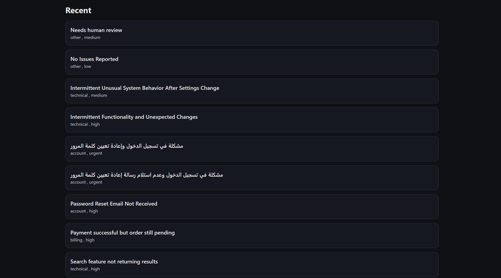

# MessageMind: AI-Powered Ticket Triage

## Objective
A small full-stack app that triages a support message using an LLM and stores the result in PostgreSQL.

## Tech stack
- Frontend: React (Vite)
- Backend: Node.js, Express.js
- Database: PostgreSQL (local)
- AI: OpenAI.

### Frontend
Contains:
- Text area input
- The result
- The last 10 items
- Loading and error states

## 📸 Screenshots

### The result


### Failure Case 1: No text was entered.

The system rejects any empty input.


### Failure Case 2: The text is too long.

The system rejects text longer than 4000 chars.


### Low Confidence

If confidence < 0.6, The system suggests human review.


### The Last 10 items

The system display the last 10 items, and keep the others in the DB.



### The prompt

```
const prompt = `
You are an AI support triage system.

Return valid JSON with these keys:
title, category, priority, summary, suggested_response, confidence

Rules:
- category: billing | technical | account | refund | other
- priority: low | medium | high | urgent
- confidence: number between 0 and 1
- No extra text.

Customer message:
"""${inputText}"""
`.trim();
```

## By: Kawthar Abuzaid
