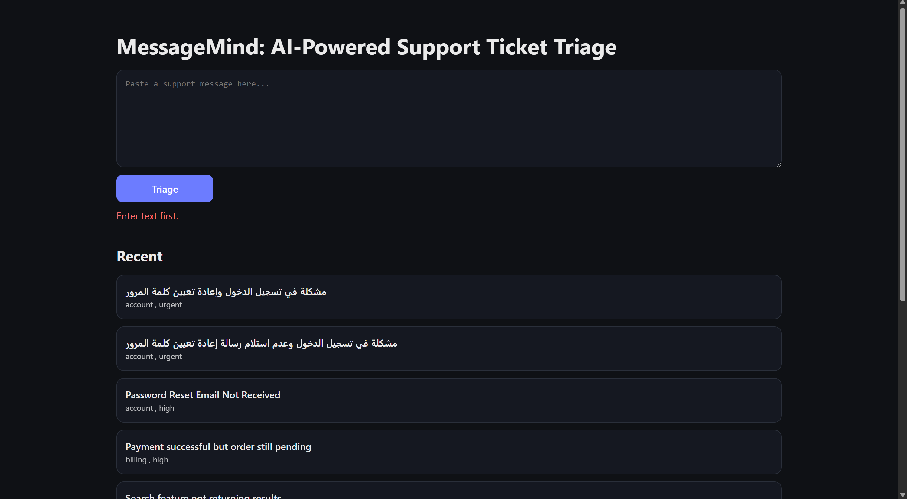
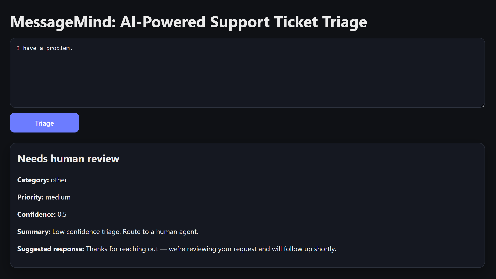

# MessageMind: AI-Powered Ticket Triage

## Objective
A small full-stack app that triages a support message using an LLM and stores the result in PostgreSQL.

## Tech stack
- Frontend: React (Vite)
- Backend: Node.js, Express.js
- Database: PostgreSQL (local)
- AI: OpenAI.

### Frontend
Implement:
- Text area input
- The result
- The last 10 items
- Loading and error states

## 📸 Screenshots

### The result

[The result](screenshots/result.png)

### Failure Case 1: No text was entered.



### Failure Case 2: The text is too long.


### Low Confidence



### The prompt


### Documentation
- Update this README with decisions and tradeoffs
- Add a short section describing:
  - Prompt design
  - Known failure cases

### Demo
5 minutes:
- run locally
- paste input
- show output
- show recent items

## API contract

### POST /triage
Input:
```json
{ "text": "..." }
```

Output:
```json
{
  "title": "string",
  "category": "billing | technical | account | other",
  "priority": "low | medium | high",
  "summary": "string",
  "suggested_response": "string",
  "confidence": 0.0
}
```

Guardrails:
- Reject empty input
- Reject text longer than 4000 chars
- If confidence < 0.6, keep the output but make it clear it needs human review

## By: Kawthar Abuzaid
